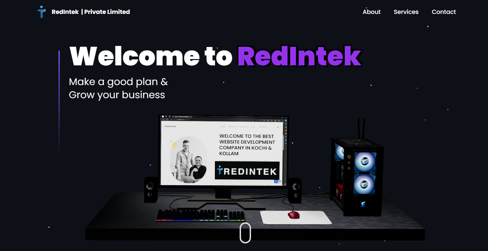
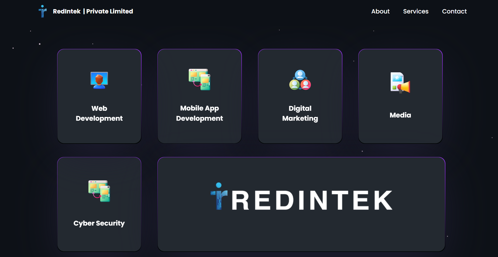
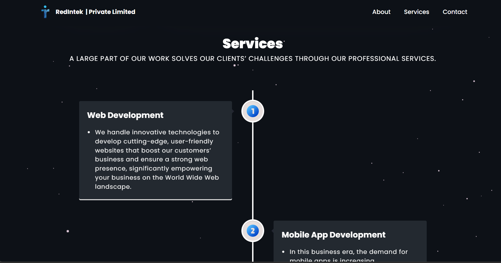
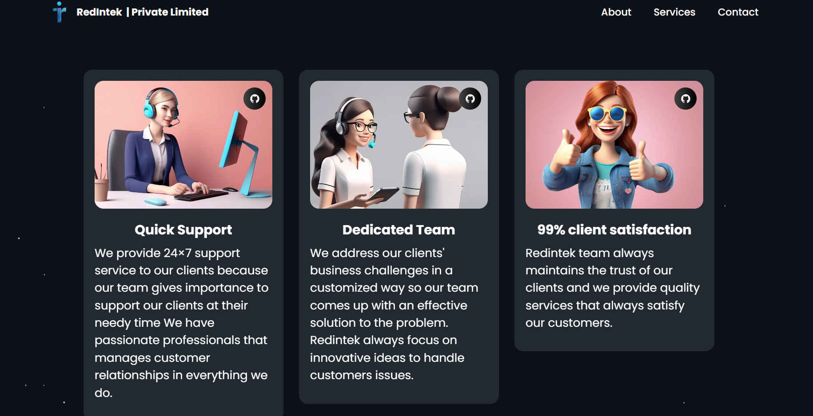
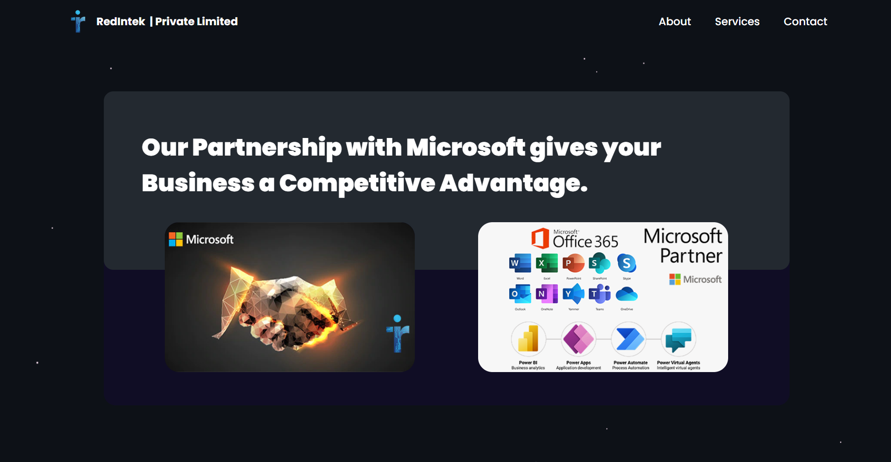

# Redintek Dashboard
## project preview
 
 
 
 
 
## Project Overview

Redintek is a comprehensive IT solutions platform designed to provide innovative and effective services in web development, digital marketing, mobile app development, media, and cybersecurity. Our dashboard, built with a modern tech stack, offers an intuitive and user-friendly interface that allows clients to explore our services and get in touch with us easily.

## Tech Stack

- **React.js**: For building the user interface and managing the application state.
- **Three.js**: To create 3D graphics and animations.
- **React Three Fiber**: A React renderer for Three.js, enabling smooth integration of 3D content within our React components.
- **React Three Drei**: Utility tools and helpers for React Three Fiber.
- **Vite**: A fast build tool that serves as our development environment.
- **Tailwind CSS**: For styling the application with utility-first CSS.

## Features

- **Navigation Bar**: 
  - **About**: Learn more about Redintek and our mission to provide tech-driven solutions.
  - **Services**: Discover the wide range of services we offer, including:
    - **Web Development**: Cutting-edge, user-friendly websites that enhance business presence.
    - **Mobile App Development**: Innovative solutions to meet business needs in the mobile space.
    - **Cyber Security**: Robust protection against cyber threats.
    - **Digital Marketing**: SEO and SMO strategies to grow your online presence.
    - **Media**: Services to enhance your social media marketing through paid ads and graphic design.
  - **Contact**: Reach out to us for any inquiries or support.

- **Client Services**:
  - **Web Development**: We use the latest technologies to create powerful websites that empower your business.
  - **Mobile App Development**: Our experts design mobile applications tailored to your business needs.
  - **Cyber Security**: Protect your business with our advanced cybersecurity services.
  - **Digital Marketing**: Boost your online presence with our SEO and SMO strategies.
  - **Media**: Enhance your social media impact with our professional media services.

- **Support**:
  - **24×7 Quick Support**: We provide round-the-clock support to ensure your business runs smoothly.
  - **Dedicated Team**: Our professionals work closely with clients to deliver custom solutions.
  - **99% Client Satisfaction**: We prioritize client satisfaction by delivering quality services.
  - **Microsoft Partnership**: Our partnership with Microsoft gives your business a competitive edge.

- **Testimonials**:
  - **Chris Brown**: Feedback on our services.
  - **Lisa Wang**: Client testimonial.

## Getting Started

### Prerequisites

To run this project locally, you'll need to have the following installed:

- Node.js (v14 or higher)
- npm or yarn

### Installation

1. Clone the repository:
   ```bash
   git clone https://github.com/Nallukumar663/redintekportfolio.git
   ```

2. Install dependencies:
   ```bash
   npm install
   # or
   yarn install
   ```

3. Start the development server:
   ```bash
   npm run dev
   # or
   yarn dev
   ```


## Deployment

For deployment, you can follow the instructions in the Vite documentation or deploy using platforms like Netlify or Vercel.

## Contributing

We welcome contributions! Please open an issue or submit a pull request if you'd like to contribute to this project.
---